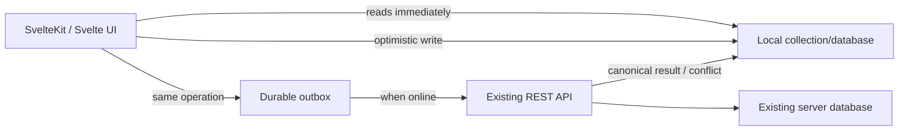
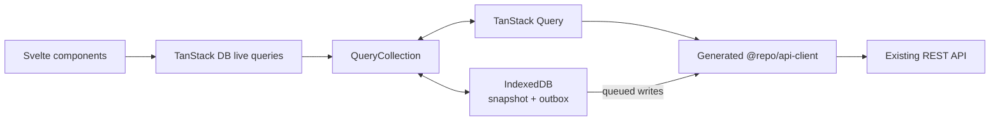
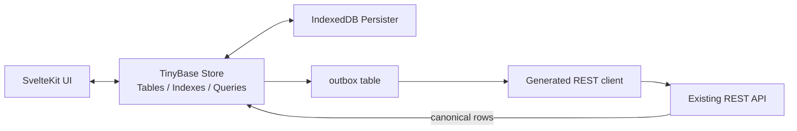
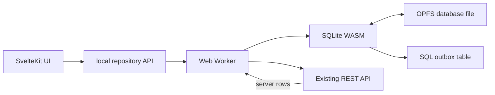
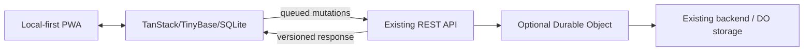
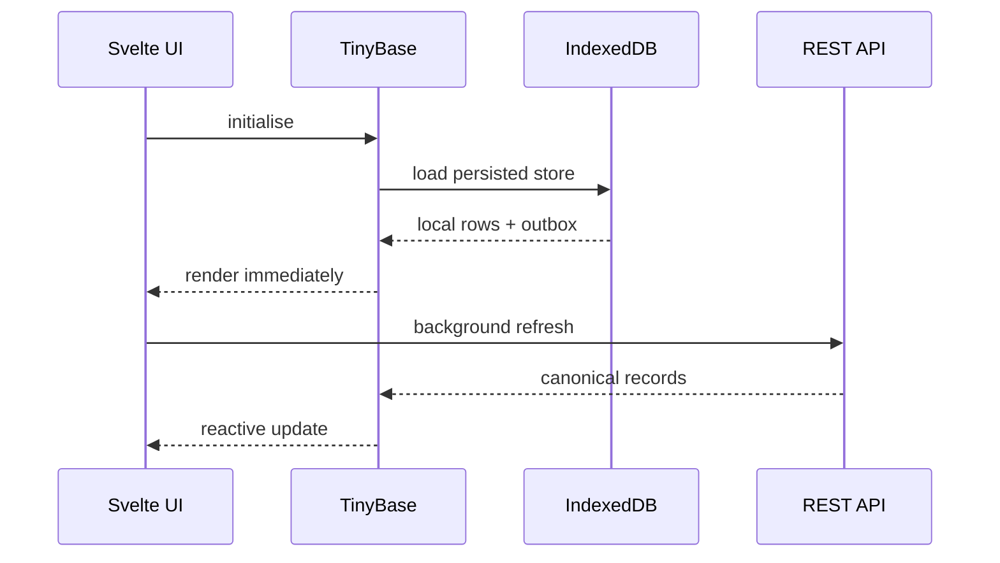
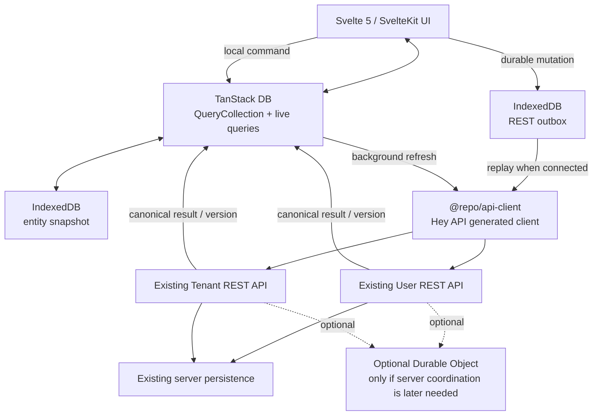

# Local-first PWA architecture for DHC-dashboard

## Executive summary

Magister, the strongest architecture for **DHC-dashboard** is to preserve the existing REST API as the sole server contract and introduce a browser-resident database plus a small, explicit **durable outbox**. Reads become local-first; writes update local state immediately and are queued for REST replay when connectivity returns. This gives offline operation without introducing ElectricSQL, Replicache, PowerSync, CRDTs, or any third-party synchronisation service.

The present repository is already unusually well positioned for a TanStack-based approach: `apps/web` uses **Svelte 5 / SvelteKit 2**, `@tanstack/svelte-query`, and the workspace's `@repo/api-client`; that API client is generated by Hey API from the existing User and Tenant Swagger/OpenAPI endpoints and generates **TanStack Svelte Query query options**. ([web package.json](https://github.com/alessandrojcm/dhc-dashboard/blob/main/apps/web/package.json); [API client package.json](https://github.com/alessandrojcm/dhc-dashboard/blob/main/packages/api-client/package.json); [OpenAPI generator configuration](https://github.com/alessandrojcm/dhc-dashboard/blob/main/packages/api-client/openapi-ts.config.ts))

My ranking is:

| Rank | Architecture | Verdict |
|---|---|---|
| **A** | **TanStack DB QueryCollection + IndexedDB persistence/outbox + existing REST API** | **Best incremental fit.** Reuses the present TanStack Query/API-client investment and entails the least architectural displacement. |
| **B** | **TinyBase + IndexedDB Persister + explicit REST outbox** | **Best clean local-first design.** Stronger separation between durable local state and REST transport, with relatively low client complexity. |
| C | SQLite WASM + OPFS + explicit REST outbox | Technically strongest local database, particularly if the dashboard eventually has large relational datasets or substantial client-side querying, but currently more machinery than the stated requirements justify. |
| D | Durable Objects | **Not a client-side local-first store.** Valuable only as an optional server-side component behind the REST API, for example to serialise per-user/per-tenant writes or maintain authoritative versions. |

TanStack DB is therefore my first recommendation, **provided persistence is deliberately engineered rather than assuming QueryCollection itself constitutes an offline database**. TanStack DB's model centres on collections, live queries and optimistic mutations, while QueryCollection uses TanStack Query to populate a collection from remote query functions. A persistent entity snapshot and mutation queue remain an application concern in the proposed REST-only design. [TanStack DB overview](https://tanstack.com/db/latest/docs/overview)

TinyBase is the safer second choice when **“the local database is the application state”** is more important than maximising reuse of the current TanStack Query stack. TinyBase provides reactive stores, queries/indexes, Svelte bindings and first-party persisters including IndexedDB, while still allowing DHC-dashboard to implement its own deliberately simple REST replay mechanism rather than adopting TinyBase synchronisers. [TinyBase documentation](https://tinybase.org/) [TinyBase persistence guide](https://tinybase.org/guides/persistence/)

SQLite WASM should become first choice only if subsequently discovered requirements include large local datasets, significant relational joins/aggregations, robust local transactions, or a need for a database format and query engine more powerful than JavaScript object/table stores. SQLite's official WASM build supports persistent browser databases through the Origin Private File System, subject to browser storage and worker constraints. [SQLite WASM documentation](https://sqlite.org/wasm/doc/trunk/index.md) [SQLite WASM persistence](https://sqlite.org/wasm/doc/trunk/persistence.md)

Durable Objects do not replace any of these client choices: they execute on Cloudflare's infrastructure and provide durable, strongly coordinated server-side state. Cloudflare now supports SQLite-backed Durable Object storage, but an offline browser cannot reach a Durable Object, so DOs cannot themselves deliver local-first behaviour. [Cloudflare Durable Objects](https://developers.cloudflare.com/durable-objects/) [Durable Objects storage](https://developers.cloudflare.com/durable-objects/api/storage-api/)

**Recommended target:**



The important architectural boundary is that **REST remains authoritative, but it ceases to be the immediate source of UI state**. The local store becomes the immediate source of truth for the running client, and REST reconciles it asynchronously.

## Current DHC-dashboard fit and design constraints

The repository's current dependency graph favours evolutionary rather than wholesale change. `apps/web/package.json` contains `@tanstack/svelte-query` and `@hey-api/client-fetch`; the workspace `@repo/api-client` package contains the generated REST client; and `openapi-ts.config.ts` explicitly generates `@tanstack/svelte-query` query options from two Swagger documents, presently the User service at port `5000` and Tenant service at port `5001` in the development configuration. ([web package](https://github.com/alessandrojcm/dhc-dashboard/blob/main/apps/web/package.json); [API generator](https://github.com/alessandrojcm/dhc-dashboard/blob/main/packages/api-client/openapi-ts.config.ts))

That makes the desirable boundary:

```text
Generated Hey API client
        │
        ├── existing REST request/response types
        │
        └── existing TanStack query options
                    │
             Local-data adapter
                    │
          Svelte components/routes
```

There is no reason to replace the generated client. The local-first layer should be added **above it**, treating generated functions as transport primitives.

The local-first semantics should be precisely limited:

| Situation | Required behaviour |
|---|---|
| Initial online load | Read local data immediately, then refresh from REST. |
| Ordinary online read | Serve local state; optionally refresh in background according to freshness policy. |
| Offline read | Serve persisted local state without making the UI depend upon failed network requests. |
| Online write | Apply locally immediately, queue it, then usually flush immediately. |
| Offline write | Apply locally immediately and persist a queued REST mutation. |
| Restart while offline | Restore both entities and pending mutations from persistent browser storage. |
| Reconnect | Replay queued operations against the existing REST API. |
| Successful replay | Replace optimistic values with the canonical server response and remove the outbox entry. |
| Conflict | Stop blindly retrying that entity and apply one of the deliberately simple policies below. |
| Logout/account switch | Erase or logically isolate that user's persisted data and mutation queue. |

This architecture does **not** require a general sync protocol. The browser needs little more than durable local state, an ordered mutation log, connectivity-triggered retry, and conflict metadata.

A sensible persisted outbox representation is:

```ts
type PendingMutation = {
  id: string;                 // client-generated mutation UUID
  entityType: string;
  entityId: string;
  operation: 'create' | 'update' | 'delete';
  body?: unknown;
  baseVersion?: string | number;
  createdAt: number;
  attempts: number;
};
```

The most useful server-side enhancement would be a version or ETag. Conditional HTTP requests are explicitly supported by HTTP semantics: a client can submit a mutation against the version it originally read, allowing the server to reject a stale write rather than silently overwrite a newer one. [RFC 9110 HTTP Semantics](https://www.rfc-editor.org/rfc/rfc9110) [RFC 9111 HTTP Caching](https://www.rfc-editor.org/rfc/rfc9111)

I would use these conflict policies, in descending preference:

**Version/ETag + reject-and-refresh.** Queue `baseVersion`; issue the REST mutation conditionally; on a stale version, fetch the current server object and present/reapply the user's change. This is the most robust option without becoming a sync engine.

**Server-wins.** On a conflict, replace the local object with the REST representation and preserve the rejected local edit separately so it is not silently lost.

**Last writer wins.** Appropriate only for low-value records where overwriting concurrent edits is acceptable. It is simple, but timestamp-based LWW depends upon meaningful server ordering rather than trusting client clocks.

Deletes should ideally remain as local **tombstones until REST acknowledgement**; otherwise a failed offline deletion followed by refresh can cause the supposedly deleted item to reappear.

Creates also need attention to retry safety. Prefer client-generated stable IDs or an API-level idempotency key where the API supports one. Without either, a lost successful response followed by retry can create duplicate server records. That is a REST/API-contract issue rather than a database issue.

## Candidate architectures and implementation characteristics

**TanStack DB with QueryCollection — recommended.**

TanStack DB is designed around typed Collections and reactive live queries, with optimistic mutation support. Its QueryCollection integration uses TanStack Query to load remote data into a collection, which maps unusually well to DHC-dashboard because the project already generates TanStack Query configuration around the REST client. [TanStack DB](https://tanstack.com/db/latest/docs/overview) [TanStack Query for Svelte](https://tanstack.com/query/latest/docs/framework/svelte/overview)



**Integration.** Keep generated query functions/query keys. Wrap the corresponding endpoint family in QueryCollections and gradually move components from “render query result” to “render collection live query”. The generated REST calls remain responsible for network I/O.

An illustrative collection is:

```ts
// API names/import locations should be aligned with the TanStack DB
// release installed during implementation.
import { createCollection } from '@tanstack/db';
import { queryCollectionOptions } from '@tanstack/query-db-collection';

export const tenants = createCollection(
  queryCollectionOptions({
    queryKey: ['tenants'],
    queryFn: () => api.listTenants(),
    getKey: (tenant) => tenant.id,
    queryClient
  })
);
```

The critical design decision is **not to equate QueryCollection's remote population mechanism with durable offline mutation storage**. Persist the last accepted entity snapshot and the outbox in IndexedDB, hydrate them during application startup, and then let REST refresh them when available. IndexedDB is the web platform's transactional object database and is designed for significant quantities of structured browser data; quota remains browser/origin policy rather than a TanStack DB limit. [Indexed Database API specification](https://www.w3.org/TR/IndexedDB/)

A mutation path becomes conceptually:

```ts
async function renameTenant(id: string, name: string) {
  // 1. Optimistically mutate the TanStack DB collection.
  tenants.update(id, (draft) => {
    draft.name = name;
    draft.syncState = 'pending';
  });

  // 2. Durably record enough information to reconstruct the REST request.
  await outbox.put({
    id: crypto.randomUUID(),
    entityType: 'tenant',
    entityId: id,
    operation: 'update',
    body: { name },
    createdAt: Date.now(),
    attempts: 0
  });

  // 3. flushOutbox() may run immediately when online.
}
```

This option's chief disadvantage is architectural rather than runtime performance: if TanStack DB, TanStack Query, persisted snapshots and the outbox are all treated as independent authorities, state ownership becomes confused. Define it explicitly: **the Collection is the reactive runtime view; IndexedDB is restart durability; REST is remote authority.**

Performance should be very good for normal dashboard workloads because reads and live-query computation stay client-side and network access leaves the rendering critical path. Bundle impact is **medium** among these options: more JavaScript than TinyBase alone, dramatically less machinery than embedding SQLite WASM. Exact production bytes should be measured against the application's actual tree-shaken build rather than relying upon a package-manager headline size, because TanStack DB and its adapters remain separately importable packages. [TanStack DB installation/documentation](https://tanstack.com/db/latest/docs/overview)

Security follows browser-storage rules: cached data is protected by origin isolation, not by application-level encryption. Code executing in the application's origin can potentially access its browser database, making XSS prevention more important once sensitive records are deliberately retained offline. Persist neither access tokens nor other secrets merely because IndexedDB is available. The W3C IndexedDB model associates databases with an origin; SvelteKit also exposes CSP configuration that should be used as defence in depth. [IndexedDB specification](https://www.w3.org/TR/IndexedDB/) [SvelteKit configuration](https://svelte.dev/docs/kit/configuration)

Migration is low-to-medium effort: introduce one collection for one high-value entity; wrap generated API functions; add IndexedDB snapshot/outbox infrastructure; redirect one screen's reads to live queries; redirect its mutations to optimistic local mutation plus outbox; then expand entity-by-entity.

**TinyBase with IndexedDB — recommended alternative.**

TinyBase provides an in-process reactive Store with tables, indexes and queries, framework UI bindings including Svelte, and persistence adapters. Its IndexedDB persister can persist a Store into the browser database. TinyBase also has separate synchronisation facilities, but those are unnecessary here; using its Store and Persister does not require adopting its synchronization layer. [TinyBase](https://tinybase.org/) [TinyBase persistence](https://tinybase.org/guides/persistence/) [TinyBase Svelte integration](https://tinybase.org/guides/ui/using-ui-frameworks/)



This is arguably the cleanest conceptual model. Put server resources in TinyBase tables and an `outbox` in the same local data model. The UI never needs REST to render already-known data. On startup, load the IndexedDB persister first and then trigger background REST refresh.

A representative Svelte-side setup is:

```ts
import { createStore } from 'tinybase';
import { createIndexedDbPersister } from 'tinybase/persisters/persister-indexed-db';

export const store = createStore();

export const persister = createIndexedDbPersister(
  store,
  'dhc-dashboard'
);

export async function initialiseLocalData() {
  await persister.startAutoLoad();
  await persister.startAutoSave();
}
```

The exact lifecycle can be encapsulated in a client-only SvelteKit module or provider; IndexedDB, like OPFS, must not be initialised during SSR. TinyBase documents its persistence APIs and framework-specific UI bindings separately. [TinyBase Persisters](https://tinybase.org/guides/persistence/) [TinyBase Svelte UI API](https://tinybase.org/api/ui-svelte/)

Offline mutations are particularly easy to understand because the entity update and pending mutation can live inside one local model. For example:

```ts
store.transaction(() => {
  store.setCell('tenants', tenantId, 'name', newName);

  store.setRow('outbox', crypto.randomUUID(), {
    entityType: 'tenant',
    entityId: tenantId,
    operation: 'update',
    body: JSON.stringify({ name: newName }),
    createdAt: Date.now()
  });
});
```

TinyBase is likely the **smallest client-side architecture** of the three genuine local stores, although exact bundle figures depend on which modules are imported and should be measured in the production build rather than treated as a permanent library property. It avoids a WASM runtime and SQL worker. [TinyBase documentation](https://tinybase.org/)

Storage capacity with the IndexedDB Persister is governed by browser origin storage policies rather than by TinyBase itself. The important architectural limitation is instead the data model: TinyBase is excellent for reactive tabular data, but SQLite is a better fit once arbitrary relational SQL, very large local result sets, or database-level schema/index sophistication become primary requirements. [TinyBase Store concepts](https://tinybase.org/guides/the-basics/using-stores/) [IndexedDB specification](https://www.w3.org/TR/IndexedDB/)

Security characteristics are the same broad class as TanStack/IndexedDB: local state is available to JavaScript executing in the application's origin. Separate data by authenticated user/tenant, erase it on logout where policy requires, and never allow a different logged-in account to inherit the previous account's persisted Store.

Migration effort is medium: design a mapping from API DTOs into TinyBase table/row/cell structures; load REST results into those tables; migrate Svelte components to TinyBase reactive hooks; add the outbox; then progressively replace direct TanStack Query rendering. The current TanStack-generated client can remain unchanged as the transport implementation.

**SQLite WASM with OPFS.**

SQLite's official WASM port can run the SQLite engine inside the browser, and the supported persistent paths include OPFS. The official documentation explicitly distinguishes the various storage backends and constraints; OPFS access is normally deployed in a Worker, keeping synchronous database work away from the UI thread. [SQLite WASM](https://sqlite.org/wasm/doc/trunk/index.md) [SQLite WASM persistence](https://sqlite.org/wasm/doc/trunk/persistence.md)



This gives the strongest transactional local-first primitive. An entity change and its outbox entry can be committed in **one SQLite transaction**, removing the two-store atomicity problem that a TanStack DB + separate IndexedDB outbox can otherwise create.

Worker-side setup is approximately:

```ts
import sqlite3InitModule from '@sqlite.org/sqlite-wasm';

const sqlite3 = await sqlite3InitModule();

// OPFS-backed database. Run this logic in an appropriate Worker.
const db = new sqlite3.oo1.OpfsDb('/dhc-dashboard.sqlite3');

db.exec(`
  CREATE TABLE IF NOT EXISTS outbox (
    id TEXT PRIMARY KEY,
    entity_type TEXT NOT NULL,
    entity_id TEXT NOT NULL,
    operation TEXT NOT NULL,
    body TEXT,
    base_version TEXT,
    created_at INTEGER NOT NULL
  )
`);
```

The exact VFS choice should follow SQLite's current OPFS guidance because the official WASM package offers multiple persistence approaches with different concurrency/browser requirements. [SQLite WASM persistence](https://sqlite.org/wasm/doc/trunk/persistence.md)

For performance, SQLite wins when DHC-dashboard must filter, aggregate, join or index a substantial local relational dataset. Conversely, a dashboard performing small keyed lookups pays complexity for worker messaging, SQL schema management and the WASM runtime that TinyBase/TanStack DB do not require. It also has the **largest bundle/download footprint of the three client candidates** because an actual SQLite WASM engine must be delivered in addition to application JavaScript. That is a structural comparison rather than a fixed byte count; the SQLite project publishes the current WASM artefacts and build documentation. [SQLite WASM](https://sqlite.org/wasm/doc/trunk/index.md)

OPFS capacity is part of browser-managed origin storage, not an unlimited local filesystem. Applications can inspect browser storage estimates through the web Storage API, and browser eviction/persistence policies must therefore still be considered. [WHATWG Storage Standard](https://storage.spec.whatwg.org/)

SQLite does **not encrypt the OPFS file merely because it is SQLite**. An XSS-compromised application still runs within the same browser security principal. Client-side database encryption is also difficult to make meaningful if the decryption key must be available automatically to that same JavaScript; preventing XSS and limiting what is cached remain the primary controls.

Migration effort is the highest client-side option: define SQL schemas and migrations, introduce a Worker/RPC repository boundary, translate generated REST DTOs to relational records, build reactive Svelte subscriptions or invalidation, implement the SQL outbox, then migrate features progressively. This remains attractive should future requirements justify it.

**Durable Objects as optional server persistence.**

Durable Objects are Cloudflare server-side objects that combine compute with durable storage and provide a coordination point for state associated with an object identity. Cloudflare supports SQLite storage for Durable Objects. They are therefore useful for serialising updates or maintaining per-user/per-tenant authoritative versions, but they cannot provide browser operation while disconnected. [Cloudflare Durable Objects](https://developers.cloudflare.com/durable-objects/) [SQLite-backed Durable Objects](https://developers.cloudflare.com/durable-objects/best-practices/access-durable-objects-storage/)

The only architecture I would endorse under the stated constraints is:



The browser should **not bypass the existing REST API and call a Durable Object as a new sync service**. Instead, where the REST infrastructure is hosted on or can call Cloudflare, the API may route a resource to the corresponding Durable Object. This makes DO an implementation detail of the existing REST contract.

Its primary potential benefit would be conflict control: route all mutations for a tenant/user/resource family to the same object, serialise them there, increment an authoritative version, and return that version to the PWA. Cloudflare's model makes DOs appropriate for state requiring coordination. [Durable Objects overview](https://developers.cloudflare.com/durable-objects/)

Its client bundle impact is effectively negligible because the browser merely continues making REST requests. Its disadvantages are server infrastructure coupling, Cloudflare billing/runtime limits, an additional operational subsystem, and no improvement to offline capability by itself. Current quota and storage values should deliberately be taken from Cloudflare's live limits page rather than hard-coded into architectural assumptions because they are service-plan properties. [Durable Objects limits](https://developers.cloudflare.com/durable-objects/platform/limits/)

Migration, if ever warranted, should happen after the client local-first conversion: preserve REST DTOs/endpoints, add version metadata, introduce a DO behind one resource family, route REST operations through it, validate ordering/conflicts, then expand only where contention warrants the operational cost.

## PWA, offline shell and reconciliation design

The PWA layer should perform a **different job from the database layer**. The service worker makes the application code/startup shell available offline; the local database supplies business data; the outbox handles offline mutations. Do not try to turn the service-worker HTTP cache into the application database, and do not attempt to “cache POST requests” as a substitute for an outbox.

SvelteKit has native service-worker support: a `src/service-worker.js` or `src/service-worker.ts` entry can use the `$service-worker` module, whose `build`, `files` and `version` exports are intended for managing generated/static application assets. [SvelteKit service workers](https://svelte.dev/docs/kit/service-workers) [$service-worker reference](https://svelte.dev/docs/kit/$service-worker)

A minimal implementation is:

```ts
/// <reference lib="webworker" />

import { build, files, version } from '$service-worker';

const worker = self as unknown as ServiceWorkerGlobalScope;
const CACHE = `dhc-dashboard-${version}`;
const ASSETS = [...build, ...files];

worker.addEventListener('install', (event) => {
  event.waitUntil(
    caches.open(CACHE).then((cache) => cache.addAll(ASSETS))
  );
});

worker.addEventListener('activate', (event) => {
  event.waitUntil(
    caches.keys().then((keys) =>
      Promise.all(
        keys
          .filter((key) => key.startsWith('dhc-dashboard-') && key !== CACHE)
          .map((key) => caches.delete(key))
      )
    )
  );
});

worker.addEventListener('fetch', (event) => {
  const request = event.request;
  const url = new URL(request.url);

  // Business API calls stay under application/outbox control.
  if (request.method !== 'GET' || url.origin !== worker.location.origin) {
    return;
  }

  // Cache application build/static resources only.
  if (ASSETS.includes(url.pathname)) {
    event.respondWith(
      caches.match(request).then(
        (cached) => cached ?? fetch(request)
      )
    );
  }
});
```

For an authenticated dashboard, I would **not indiscriminately cache personalised server-rendered HTML**. A generic application shell plus client-side local data is safer: otherwise a shared browser profile can retain account-specific HTML independently of the carefully partitioned local database. The service-worker cache is origin-scoped browser storage just like the local database.

The basic manifest can live at `apps/web/static/manifest.webmanifest`:

```json
{
  "name": "DHC Dashboard",
  "short_name": "DHC",
  "start_url": "/",
  "scope": "/",
  "display": "standalone",
  "icons": [
    {
      "src": "/icons/icon-192.png",
      "sizes": "192x192",
      "type": "image/png"
    },
    {
      "src": "/icons/icon-512.png",
      "sizes": "512x512",
      "type": "image/png"
    }
  ]
}
```

and be referenced in `src/app.html`:

```html
<link rel="manifest" href="/manifest.webmanifest" />
```

SvelteKit's service-worker mechanism itself is sufficient for the caching part; an additional Vite PWA plugin is optional rather than architecturally necessary. [SvelteKit service workers](https://svelte.dev/docs/kit/service-workers)

The online/offline reconciler should run in normal application code:

```ts
window.addEventListener('online', () => {
  void flushOutbox();
});

// Also flush on login and after successful application initialisation.
void flushOutbox();
```

`navigator.onLine` is only a trigger/hint; actual REST failure is authoritative. The flush algorithm should therefore be failure-driven:

```ts
async function flushOutbox() {
  for (const item of await outbox.pendingInOrder()) {
    try {
      const serverEntity = await sendViaExistingRestApi(item);
      await acceptServerResult(item, serverEntity);
      await outbox.remove(item.id);
    } catch (error) {
      if (isConflict(error)) {
        await markConflict(item);
        continue; // unrelated entities may still proceed
      }

      if (isAuthFailure(error)) {
        return; // wait for successful re-authentication
      }

      if (isNetworkOrRetryableServerFailure(error)) {
        return; // retain durable queue
      }

      await markPermanentFailure(item, error);
    }
  }
}
```

For multiple writes, preserve ordering **per entity**, while unrelated entities can later be flushed concurrently. An update followed by a delete must not arrive at the REST server in the reverse order.

Avoid relying on Background Sync as the only replay mechanism. Normal startup, the browser `online` event and every successful authenticated network transition should all attempt a flush. This gives deterministic behaviour on browsers where optional background capabilities differ.

Authentication is the largest unspecified design variable. The safe default is: do not put bearer/refresh credentials into TinyBase, IndexedDB or SQLite merely to facilitate replay; when authentication has expired, leave the outbox untouched and resume after the application establishes an authenticated REST session. Persisted data should be namespaced at minimum by something such as:

```text
local database identity =
    application + environment + authenticated-user-id + tenant-id
```

so that switching tenant or account cannot expose another account's cached dataset.

## Recommendation matrix

Scores below are architectural assessments for **this repository and the stated constraints**, rather than vendor benchmarks. `5` is best for DHC-dashboard.

| Criterion | TanStack DB + QueryCollection | TinyBase + IndexedDB | SQLite WASM + OPFS | Durable Objects |
|---|---:|---:|---:|---:|
| Existing REST API preserved | **5** | **5** | **5** | 5 if kept behind REST |
| Fit with current codebase | **5** | 3 | 2 | 2 |
| True offline reads | 4† | **5** | **5** | **1** |
| Durable offline writes | 4† | **5** | **5** | **1** |
| Simple conflict handling | **5** | **5** | **5** | 5 server-side |
| Transactional entity + outbox | 3† | 4 | **5** | N/A client-side |
| Reactive Svelte ergonomics | **5** | **5** | 3 | 1 |
| Complex local querying | 4 | 4 | **5** | 1 offline |
| Small runtime footprint | 4 | **5** | 2 | **5 client-side** |
| Low migration cost | **5** | 4 | 2 | 2 |
| Large/relational dataset headroom | 4 | 3 | **5** | N/A client-side |
| Browser persistence complexity | 3 | **5** | 3 | N/A |
| Operational/server simplicity | **5** | **5** | **5** | 2 |
| Overall under stated assumptions | **4.6/5** | **4.4/5** | **3.7/5** | **2.3/5** |

† For TanStack DB, those scores assume the recommended **explicit persistent snapshot/outbox**. QueryCollection by itself should not be treated as a durable offline-write system.

A more decision-oriented comparison is:

| Option | Persistence | Practical storage ceiling | Performance profile | Bundle impact | Main security consideration | Main engineering hazard |
|---|---|---|---|---|---|---|
| **TanStack DB** | Add IndexedDB-backed snapshots/outbox | Browser-origin quota | Excellent reactive UI/local lookup | Medium | Local account data readable to same-origin JS | Accidentally creating several competing sources of truth |
| **TinyBase** | First-party IndexedDB Persister | Browser-origin quota | Excellent normal dashboard/tabular workloads | **Low** | Same-origin/XSS and logout isolation | Mapping REST DTOs to Store schema cleanly |
| **SQLite WASM** | OPFS | Browser-origin quota | **Best for relational querying/transactions** | **High** | OPFS DB is not inherently secret/encrypted | Worker/VFS/schema/reactivity complexity |
| **Durable Objects** | Cloudflare durable/SQLite storage | Cloudflare current service limits | Network/server-side; coordinated state | Near-zero client impact | Server access-control/data-residency concerns | New infrastructure without solving offline client state |

The fundamental choice is therefore not “which technology can synchronise?” None should be allowed to become a sync engine. It is **which local state model best surrounds the REST outbox**.

## Top implementation paths

**Preferred path — TanStack DB QueryCollection.**

Planning estimate: **roughly 7–12 engineer-days for a production-quality first vertical slice plus shared infrastructure**, followed by approximately **0.5–1.5 days per ordinary entity family**. These are engineering planning estimates, not vendor claims, and can rise materially if the current REST mutations lack stable IDs/versioning or authentication behaves poorly offline.

**Day-scale phase: establish the PWA shell.** Add `manifest.webmanifest`, icons and `src/service-worker.ts`; cache only static/build assets initially; verify cold-start online, warm-start offline and version upgrades. Add an explicit offline indicator based on actual API failures as well as browser connectivity.

**Then establish one persistence boundary.** Add a small first-party IndexedDB module with schema versions for `entitySnapshots`, `outbox` and lightweight local metadata. Establish database naming by environment/user/tenant. Implement logout purge and database-version migration before persisting real customer data.

**Then adapt one generated REST resource.** Choose a representative resource with GET/list/update/delete operations. Reuse the generated query key/query function in a TanStack DB QueryCollection; load the persisted snapshot during client startup; when REST succeeds, atomically update the persisted snapshot as closely as the chosen adapter permits.

**Then redirect reads.** Components should consume TanStack DB live data rather than reading generated Query results directly:

```text
Before:
component → TanStack Query → REST

After:
component → TanStack DB Collection
                         ↑
       persisted state + REST refresh
```

This is the point at which the application becomes observably local-first: reload the app offline and the same screen should still render.

**Then redirect mutations through a command layer.**

```ts
updateTenant(...)
deleteTenant(...)
createTenant(...)
```

Each command performs optimistic collection mutation and durable outbox insertion. Components cease calling generated mutation functions directly. Only the outbox/reconciliation module may execute remote mutations.

**Then implement reconciliation.** Flush at application startup, after login, on connectivity restoration and immediately after new writes when online. Preserve per-entity ordering. Update local entities using the REST response rather than assuming the optimistic request body represents canonical server state.

**Then add conflicts.** Ideally expose an API version/ETag from reads and require it on updates/deletes. For `409`/`412`-style conflict responses, mark the local entity as `conflicted`, fetch its latest representation and use a small UX such as:

```text
Your local change:
    Name = "A"

Server currently contains:
    Name = "B"

[Use server version]  [Reapply my change]
```

No automatic field-level merging is required.

**Then expand entity-by-entity.** The migration can coexist with existing TanStack Query screens. Do not perform a flag-day conversion.

Principal risks are the persistence gap between a TanStack DB mutation and a separate IndexedDB outbox write; confusion between Query cache, Collection, persistence and REST authority; changing TanStack DB APIs if adopting a fast-moving release; and duplicate create operations if the REST layer lacks idempotency.

The principal mitigations are a single application command/repository layer, exhaustive offline/reload tests, stable mutation IDs, explicit schema versions and keeping transport generated code untouched.

**Alternative path — TinyBase.**

Planning estimate: **roughly 9–15 engineer-days for infrastructure plus the first production vertical slice**, followed by approximately **1–2 days per typical resource family**. The slightly greater initial cost arises because existing Svelte components using TanStack Query must change state abstraction rather than merely gaining a TanStack DB layer.

First establish the same service worker, PWA manifest, authentication partitioning and conflict contract. Those concerns are independent of the database.

Then create a TinyBase `Store` whose tables correspond to local application concepts, not necessarily one-for-one REST endpoints:

```text
users
tenants
dashboardItems
...
outbox
syncMetadata
```

Keep REST transport models at the boundary. Add explicit mapping functions:

```ts
restTenantToLocal(...)
localTenantPatchToRest(...)
```

This prevents an accidental requirement to rewrite the local database every time a generated DTO receives a transport-specific field.

Next attach `createIndexedDbPersister()` and make initialisation client-only. Startup ordering should be:



Next migrate one screen so all reads come from TinyBase. Keep the current generated REST client behind repository functions; retiring TanStack Query from that screen is acceptable because it continues to be useful elsewhere during migration.

Then build local command functions. TinyBase's transactional Store model allows the visible entity and its outbox metadata to be altered together at the application-store level, reducing the risk that an offline edit becomes visible but not replayable.

Then implement the same outbox flusher and conflict machinery described for TanStack DB. The wire protocol is intentionally identical. This is valuable because it keeps the application's sync semantics independent of the chosen local-store implementation.

Finally migrate screens progressively and remove redundant TanStack Query caching only when a complete resource family uses TinyBase.

Principal risks are maintaining two state stacks during migration, accidentally duplicating server-normalisation/business rules in the local Store, and table design becoming awkward if the API data is deeply nested.

The corresponding mitigations are DTO mapping functions, keeping the local schema oriented around UI access patterns, and avoiding premature normalisation.

I would promote **SQLite WASM above TinyBase** only after profiling or requirements analysis demonstrates at least one of these conditions: substantial local row counts; SQL joins or non-trivial aggregates are central; many indexes are required; one atomic database transaction across entities/outbox is especially important; or long-term client database sophistication outweighs bundle/startup/Worker simplicity. SQLite's official WASM/OPFS support makes that architecture entirely legitimate when those conditions exist. [SQLite WASM persistence](https://sqlite.org/wasm/doc/trunk/persistence.md)

## Risks, unresolved variables and final recommendation

The unspecified details do not prevent an architectural decision, but they materially affect implementation policy.

**Authentication** is the most consequential unknown. If the REST API relies on short-lived bearer tokens held only in memory, queued mutations must wait for normal re-authentication after browser restart. That is preferable to persisting authentication secrets in the local database. If the application already uses secure server-managed cookies, replay may be substantially simpler.

**API concurrency metadata** is the next. Inspect whether the current User and Tenant APIs expose an `ETag`, revision, row version or trustworthy server `updatedAt`. If none exists, the first backend change I would make is a monotonically changing version on mutable records. This changes neither the REST architecture nor the requirement against sync engines; it simply gives ordinary REST requests enough information to reject stale writes. HTTP conditional requests provide the relevant standard mechanism. [RFC 9110](https://www.rfc-editor.org/rfc/rfc9110)

**Create idempotency** needs verification. Offline replay inevitably creates uncertain-delivery scenarios. Stable client-generated IDs are ideal where domain rules permit them; otherwise an API-recognised mutation/idempotency identifier is preferable.

**Data volume** determines whether SQLite's additional machinery is justified. IndexedDB-backed TanStack/TinyBase state is the correct default under “no specific scale constraint”; SQLite should be adopted because concrete query/data requirements demand SQL, not merely because a persistent SQL engine is available.

**Browser quota and eviction** apply to both IndexedDB and OPFS. No candidate should promise an invariant number of local gigabytes because quota is controlled by the user agent and storage context. The web Storage Standard defines the platform storage model. [WHATWG Storage Standard](https://storage.spec.whatwg.org/)

**Schema migration** is required whichever option is chosen. Persist a `schemaVersion`, migrate records transactionally where practical, and retain the ability to invalidate/rebuild *server-derived* local state without discarding unsent outbox operations. The outbox is the irreplaceable part; cached server records can normally be fetched again.

**Security** requires treating an offline PWA as a device-resident copy of server information. Use least-necessary caching, partition by user and tenant, purge appropriately on sign-out, avoid credentials in application databases, keep the cached app shell free of personalised SSR data, and strengthen CSP/XSS protections. IndexedDB and OPFS provide browser-origin isolation, not an encrypted trusted enclave. [IndexedDB specification](https://www.w3.org/TR/IndexedDB/) [WHATWG Storage Standard](https://storage.spec.whatwg.org/) [SvelteKit configuration](https://svelte.dev/docs/kit/configuration)

The recommended final architecture is therefore:



**Adopt TanStack DB + QueryCollection first, retaining the existing generated REST/TanStack Query integration and adding a deliberately small IndexedDB persistence/outbox layer.** It gives DHC-dashboard the shortest migration path and preserves existing investments while still satisfying local-first and offline requirements. [DHC-dashboard web package](https://github.com/alessandrojcm/dhc-dashboard/blob/main/apps/web/package.json) [DHC-dashboard API generator](https://github.com/alessandrojcm/dhc-dashboard/blob/main/packages/api-client/openapi-ts.config.ts) [TanStack DB](https://tanstack.com/db/latest/docs/overview)

**Keep TinyBase + IndexedDB as the preferred fallback** if the TanStack architecture begins to require too much custom persistence glue or multiple overlapping caches become difficult to reason about. TinyBase produces the cleaner “one durable local Store drives the application; REST merely reconciles it” architecture. [TinyBase persistence](https://tinybase.org/guides/persistence/)

**Do not introduce Durable Objects initially.** They solve a server coordination problem that has not yet been established and do nothing for disconnected clients. Introduce them later only if actual concurrent-write contention or per-tenant serialisation requirements emerge. [Cloudflare Durable Objects](https://developers.cloudflare.com/durable-objects/)

**Do not begin with SQLite WASM under the present assumptions.** Preserve it as the deliberate escalation path if real data volume, complex relational local queries or transactional requirements emerge. Its OPFS persistence is technically stronger, but the Worker/WASM/schema/reactivity burden is presently unnecessary. [SQLite WASM](https://sqlite.org/wasm/doc/trunk/index.md) [SQLite WASM persistence](https://sqlite.org/wasm/doc/trunk/persistence.md)

The governing design should remain simple:

> **Local store for immediate state; durable outbox for intent; existing REST API for reconciliation; server version for conflict detection; no general-purpose sync layer.**

That architecture satisfies the stated constraints while leaving DHC-dashboard free to move from TanStack DB to TinyBase or SQLite later without changing its REST contract or its fundamental offline protocol.