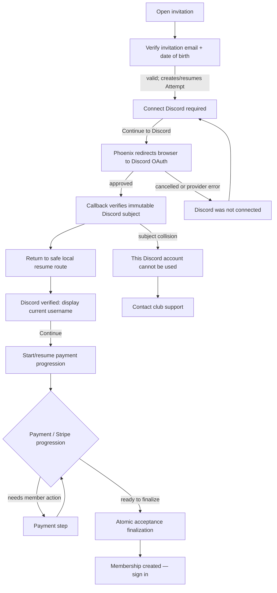

# Discord-bound Invitation Acceptance experience

**Status:** Proposed interaction contract for human review  
**Ticket:** ALE-207  
**Depends on:** ALE-204 / ADR-0014; consistent with ALE-202, ADR-0013, and ADR-0010  
**Scope:** Product flow and browser/API boundary only. This is not a production UI or an OpenAPI change.

## The promise shown to an invitee

Invitation Acceptance is **registration**, not sign-in. It requires the person to
prove the invitation details, verify a Discord account, and complete the
membership payment path. Only the final successful conversion creates their
Principal, Member records, Membership, member Role, and Discord External
Identity together. It does **not** create a dashboard Session or send a magic
link.

The experience must say this in plain language:

> **Create your membership**  
> We need to verify the Discord account you will use with the club. You will
> sign in to Discord in a new step and then return here. Creating your
> membership does not sign you in; once it is complete, use the normal sign-in
> page with your invitation email.

Do not ask for a Discord username, promise that a Discord email will be used,
or describe the step as “linking an account” before acceptance succeeds.

## Happy-path screen flow



### 1. Verify the invitation

The invitation landing route presents the existing invitation credential check
(invitation email and date of birth). The email is rendered as the invitation's
authoritative email once known; it is not an editable email-registration field.

On success, the backend creates or resumes the Invitation Acceptance Attempt,
then establishes an acceptance-only browser session and its short-lived Discord
Continuation. The UI immediately advances to the Discord step. A browser
session for this flow is **not** a DHC authenticated Session and must never be
displayed as one.

**Step content**

* Heading: **Connect Discord**
* Required-state text: **Discord verification is required to create this
  membership.**
* Explanation: “We will ask Discord to confirm the account. We use the account
  itself to protect the club’s membership records; its displayed name can
  change later.”
* Primary action: **Continue to Discord**
* Secondary action: **I’ll do this later** — exits without claiming that
  acceptance has happened. It does not create a Member, Principal, External
  Identity, Membership, payment, or Session.

The step does not expose a countdown as an authorization promise. If it is
still helpful to show urgency, say “For security, return and continue promptly”
rather than treating a client clock as authoritative.

### 2. Depart for OAuth and resume locally

**Continue to Discord** is a full browser navigation to a Phoenix OAuth-start
route, not an XHR/fetch redirect. Phoenix associates the opaque Continuation
identifier with the protected browser session alongside Assent's OAuth state
and PKCE verifier, then redirects to Discord.

Discord returns only to the Phoenix callback. The callback never renders the
Acceptance screen, returns a provider claim to JavaScript, creates a Principal,
links an External Identity, starts Stripe work, sends a magic link, or mints a
Session. It finishes by redirecting the browser to a same-origin local resume
route, which fetches the current safe Acceptance state.

The resume route must be safe to refresh and revisit. It is a status view, not
a bearer continuation: there is no Continuation id, provider subject, OAuth
state, or verified username in a URL, local storage, or analytics payload.

### 3. Confirm the verified Discord account

After a successful callback, show a confirmation state before payment begins:

* Heading: **Discord verified**
* Account presentation: **Verified Discord account: `@{currentUsername}`**
  (with an avatar only if provided by the safe state projection)
* Supporting text: “This is the Discord account that will be associated with
  your membership. Its display name may change.”
* Primary action: **Continue to payment**
* Secondary action: **Use a different Discord account**

`currentUsername` is a verified-at-that-moment **mutable display snapshot**.
It helps the person recognise what they approved, but is not an identifier and
must not be persisted, compared, sent back as a selection, or used to recover
from a collision. The backend alone retains the immutable Discord provider
subject until the atomic finalization creates the External Identity.

“Use a different Discord account” explicitly ends the current verified
continuation/claim without beginning Stripe work, then returns to **Connect
Discord**. The backend owns the compare-and-set transition; the client must not
assume that a local click released anything until the returned state says it
did. This action is available only before payment progression consumes the
verified continuation.

### 4. Payment and finalization

**Continue to payment** asks Phoenix to consume the browser-held verified
Continuation into the Attempt. Only a successful response may transition the
screen to payment/progress. Repeated clicks, refreshes, and requests resume the
same Attempt; they do not re-run Discord OAuth or create a second Stripe
operation.

The payment view is driven by server state, not guessed from a redirect:

* A pending/progress state says **We’re setting up your membership** and may
  poll/refetch the safe state.
* If Stripe requires a member action, render only the server-provided payment
  instruction/action. Returning from that action resumes the same Attempt.
* A recoverable payment problem says **Your Discord account is still verified.
  We could not finish the payment step yet. Try again.** Its retry targets the
  same Attempt and idempotency keys; it must not offer “Connect Discord again.”
* A terminal declined/cancelled/payment-policy outcome says that membership was
  not created and presents the server-provided next action (retry if a new
  Attempt is allowed before invitation expiry, otherwise support). It never
  implies a partial Member or successful Discord link exists.

When finalization commits, show:

> **Membership created**  
> Your membership and Discord account have been set up. You are not signed in
> yet. Sign in with **{invitationEmail}** to receive a magic link.

The only primary action is **Go to sign in**. It navigates to the ordinary
rate-limited sign-in request flow; it does not silently request a magic link.
Do not show dashboard navigation, a signed-in avatar, or “Continue to your
account.”

## State and error branches

| Server state / event | What the person sees | Allowed client action | Important semantic boundary |
| --- | --- | --- | --- |
| `awaiting_oauth` | **Connect Discord** | Navigate to OAuth start; leave for later | No verified identity and no Stripe work exist. |
| Discord denies/cancels (`access_denied`) | **Discord was not connected.** “No membership or payment was created. You can try again when ready.” | **Try Discord again** | The cancelled continuation is ended and zeroized; a new one is created only through the server's credential/Attempt rules. |
| Provider/OAuth/PKCE failure | **We could not verify Discord.** “Try again; if this continues, contact support.” | **Try Discord again**, support | Do not reveal provider diagnostics or infer whether an account exists. |
| Browser session, OAuth state, or continuation missing/replaced after return | **For your security, start the Discord step again.** | **Verify invitation details again** | The flow cannot be recovered from URL values, client storage, or a guessed Attempt id. No Stripe work starts. |
| Continuation or unopened invitation expired | **This invitation step has expired.** | Start over only when the server permits; otherwise support | A new continuation/Attempt cannot begin after invitation expiry. An already-authorized active Attempt has the ADR-0014 expiry fence and is shown through its payment state instead. |
| `verified` | **Discord verified** with `@currentUsername` | Continue to payment; before consumption, use another account | Username is display metadata; the subject remains secret and immutable. |
| Existing External Identity or active subject claim collision | **This Discord account cannot be used for this invitation.** “For privacy, we cannot share account details. Please contact club support.” | **Contact club support** | Terminal for this Attempt; no payment is created. Never disclose the matched member, email, principal, guild nickname, or whether the account is already club-linked. |
| Duplicate callback/resume/refresh | Current safe state (verified, payment, or complete) | Continue according to state | No duplicate claim, Stripe call, Member, External Identity, Role, Membership, or Session. |
| Stripe is retrying/reconciling | **We’re still confirming your membership.** | Refresh/retry only when the state declares it safe | Keep the verified Continuation and claim; do not require OAuth again. |
| Unexpected finalization uniqueness conflict | **We’re checking your membership status.** then support-oriented recovery if unresolved | Refresh; contact support when directed | This is a reconciliation incident, never a fallback that binds a different account or signs the person in. |
| `accepted` / finalized | **Membership created** | Go to sign in | Acceptance succeeded but no authenticated Session exists. |

## Frontend/API interaction contract

The API should expose a small, state-driven Acceptance resource. Route and
operation names below are proposed contract names for the eventual OpenAPI
work; the discriminated state and security properties are the requirement.

### Browser ownership and navigation

| Interaction | Request / navigation | Response contract |
| --- | --- | --- |
| Verify invitation details | `POST /api/onboarding/invitation-acceptance/verify` with credential fields | Establishes/updates only the protected acceptance browser session. Returns a safe Acceptance view. No session token, raw Continuation id, Discord subject, or Stripe secret is returned. |
| Read/resume screen | `GET /api/onboarding/invitation-acceptance` | Returns the current safe view for this browser flow. Safe to refresh; returns a recoverable `restart_verification` state when browser proof is absent. |
| Leave for Discord | Browser navigation to `GET /api/onboarding/invitation-acceptance/discord` | Phoenix validates `awaiting_oauth`, records the Continuation against Assent state/PKCE in the protected browser session, then responds with a redirect to Discord. |
| OAuth callback | Discord → Phoenix callback route | Phoenix validates OAuth and updates durable state. It responds only with a redirect to `/accept-invitation/resume`; no JSON claim response and no Session. |
| Use another Discord account | `POST /api/onboarding/invitation-acceptance/discord/cancel` | Valid only before payment consumption. Ends the verified continuation/claim and returns `awaiting_oauth` or the credential-reverify state prescribed by the server. |
| Begin/resume payment | `POST /api/onboarding/invitation-acceptance/continue` | Atomically consumes a verified continuation into the Attempt, then returns a payment/progress safe view. Duplicate calls return the same Attempt view. |
| Retry a server-declared recoverable payment step | `POST /api/onboarding/invitation-acceptance/retry` | Resumes the same Attempt and its stable provider idempotency keys. It never starts OAuth or a new Attempt. |

All mutating calls use same-origin cookies and ordinary CSRF protection. The
frontend uses the generated API client once the OpenAPI contract exists; it does
not construct URLs, forward cookies manually, or call Phoenix with bare
`fetch`.

### Safe view shape

Every non-navigation response projects one explicit state. The frontend renders
only that state and its server-provided allowed actions; it must not derive
eligibility from timestamps or retain previous sensitive data when state
changes.

```ts
type InvitationAcceptanceView =
  | { state: 'verify_invitation'; invitationEmail?: string }
  | { state: 'awaiting_oauth'; invitationEmail: string }
  | { state: 'restart_verification'; reason: 'browser_proof_lost' | 'continuation_expired' }
  | { state: 'discord_verified'; invitationEmail: string; discord: { username: string; avatarUrl?: string }; allowedActions: ['continue_payment', 'change_discord'] }
  | { state: 'payment_pending'; invitationEmail: string; message: string; retryAllowed: boolean; paymentAction?: PaymentAction }
  | { state: 'payment_needs_action'; invitationEmail: string; paymentAction: PaymentAction }
  | { state: 'payment_terminal'; invitationEmail: string; nextAction: 'retry_acceptance' | 'contact_support' }
  | { state: 'discord_unavailable'; reason: 'cancelled' | 'verification_failed' }
  | { state: 'discord_collision' }
  | { state: 'invitation_expired' }
  | { state: 'accepted'; invitationEmail: string };
```

`PaymentAction` must be an explicit, server-authorized presentation/action
descriptor appropriate to the payment integration. It is not a client-selected
amount, a raw Stripe operation, or permission to skip finalization. The server
is authoritative for price, currency, payment status, Attempt lifecycle, and
when finalization may run.

The view deliberately excludes: `continuationId`, `attemptId` (unless an
opaque support-safe reference is later justified), Discord `providerSubject`,
Discord email, claim status, matching Principal/Member data, OAuth state/PKCE
values, and any DHC authentication/session credential.

### Transition rules the API must enforce

1. `continue` is accepted only for a browser-held `verified` Continuation and
   consumes it once into its active Attempt before Stripe progression.
2. `retry` operates only when the Attempt itself declares a recoverable payment
   transition. It never refreshes Discord proof or changes immutable identity.
3. `change_discord` is rejected once payment progression has consumed the
   Continuation; the payment/retry state remains authoritative.
4. A collision closes the Attempt and returns the neutral collision state. The
   frontend has no alternate bind, account lookup, or username-based recovery
   call.
5. Final success returns only `accepted` and the invitation email needed to
   describe normal sign-in. It sets no DHC authenticated Session cookie.

## Review decisions to settle before implementation

1. **Payment handoff shape:** confirm whether `PaymentAction` will be an
   embedded payment UI, a full-page provider redirect, or a Stripe-hosted
   redirect. Each must return to the same state-driven resume route.
2. **“Use a different Discord account” label:** retain this explicit choice
   only if product wants pre-payment account correction; otherwise remove it
   and make cancellation/reverification the only route back. The server rule
   remains the same.
3. **Support destination:** supply the club support URL/contact method to place
   behind **Contact club support**. It must not include identity details in the
   query string.
4. **Progress delivery:** decide whether `payment_pending` is short polling,
   server-sent update, or refresh-only. The state contract works with any of
   these and avoids a client-side completion guess.

## Non-negotiable implementation checks

* No OAuth callback, resume response, payment response, or success page creates
  or implies a DHC Session.
* The only lasting Discord-to-Principal association is the External Identity
  inserted by atomic finalization; username is a mutable snapshot.
* A cancelled, expired, failed, or collision Continuation zeroizes raw Discord
  subject/display metadata and releases its claim as ADR-0014 requires.
* Account collision is neutral and support-directed, with no account
  enumeration or Stripe work.
* A payment retry continues the durable Attempt and claim; it does not repeat
  OAuth. A declined/closed Attempt may start anew only under the server's
  invitation-expiry and credential-verification fences.
